# Internet of Toys (IoT)

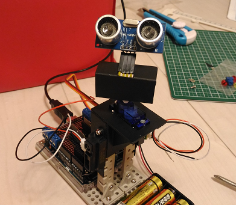

##Goal

I often see robots at museums on weekends.

My favorit robots:
- [Asimo](http://asimo.honda.com/)
- [Pepper](http://www.softbank.jp/en/robot/)
- [PaPeRo](https://en.wikipedia.org/wiki/PaPeRo)
- [Robokyu](http://www.tfd.metro.tokyo.jp/ts/soubi/robo/05.htm)
- [Mindstorms](https://en.wikipedia.org/wiki/Lego_Mindstorms)

I want to make a toy robot on my own.

####Model 001


####Current status

September 12th, 2016.

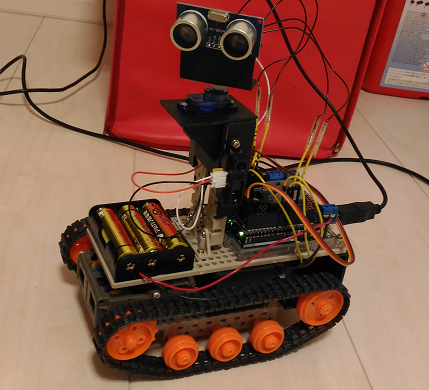
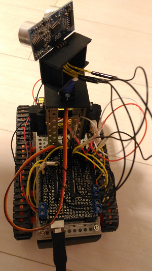
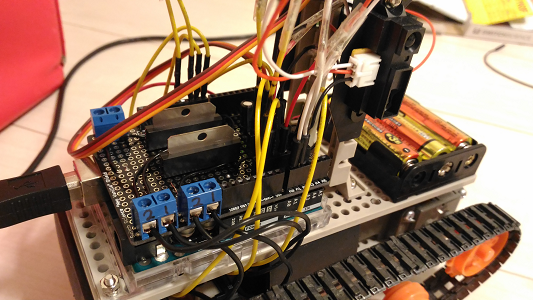

##Infrastructure

###Device

####Arduino Uno (AVR ATmega16U2)

Main controller.

[pic of my arduino-uno](./doc/arduino-uno.png)

####Original shield for Arduino Uno

Control unit for motors.

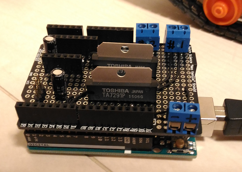

####Raspberry Pi (ARM Cortex-A53)

"IoT gateway" for connectivity to the Internet.

[pic of my rpi3](./doc/rpi3.png)

####WiFi module

[ESP-WROOM-02](http://espressif.com/en/products/hardware/esp-wroom-02/overview) as an additional micro controller as well as for connectivity to the IoT gateway.

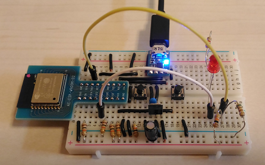

Thanks to [TORANJISTA GIJYUTSU](http://toragi.cqpub.co.jp/tabid/775/Default.aspx) and [Akizuki Denshi](http://akizukidenshi.com/catalog/g/gK-09758/).

####Parts

|part                  |product name                   |maker        |quantities|procured|
|----------------------|-------------------------------|-------------|---------|--------|
|Single board computer |Raspberry Pi 3                 |Raspberry Pi |1        |Y       |
|Micro controller      |Arduino Uno R3                 |Arduino      |1        |Y       |
|WiFi module           |[ESP-WROOM-02](http://espressif.com/en/products/hardware/esp-wroom-02/overview)|Espressif|1|Y|
|Logic level converter |[8bit bidrectional logic level converter (FXMA408)](http://akizukidenshi.com/catalog/g/gM-04522/)|Akizuki Denshi|1        |Y       |
|Regulator             |TA48M033F                      |Toshiba      |1        |Y       |
|Regulator             |TA48M05F                       |Toshiba      |1        |Y       |
|Servo motor           |Micro serve g9 SG90            |Tower Pro    |1        |Y       |
|Capacitor             |100 micro farad                |Rubycon      |1        |Y       |
|Capacitor             |10 micro farad                 |Rubycon      |2        |Y       |
|AD converer           |[MCP3008](http://ww1.microchip.com/downloads/en/DeviceDoc/21295C.pdf)                        |Microchip    |1        |Y        |
|Thermister            |[MCP9700](http://ww1.microchip.com/downloads/en/DeviceDoc/21942e.pdf)                        |Microchip    |1        |Y        |
|Proxymity sensor      |[HC-SR04](http://www.micropik.com/PDF/HCSR04.pdf)|SainSmart    |1        |Y       |
|Proxymity sensor      |[GP2Y0A21YK0F](http://www.sharpsma.com/webfm_send/1489)|Sharp   |2       |Y       |
|Photo micro sensor    |[EE-SX460-P1](https://www.omron.com/ecb/products/pdf/en-ee_sx460_p1.pdf)|Omron |2   |Y   |
|LED(red)              |                               |             |1        |Y       |
|LED(blue)             |                               |             |1        |Y       |
|CdS                   |MI5                            |Macron       |1        |Y       |
|Motor driver          |[TA7291P](http://www.promelec.ru/pdf/ta7291p.pdf)|Toshiba      |2        |Y        |
|Double gearbox        |[Double gearbox 70168](http://www.tamiya.com/japan/products/70168double_gearbox/)|Tamiya       |1        |Y       |
|Track and wheel       |[Track and wheel set 70100](http://www.tamiya.com/japan/kousaku/k_products/70100_t&w.htm)|Tamiya       |1        |Y       |
|Universal plate       |[Universal plate set 70157](http://www.tamiya.com/japan/products/70157plate/index.htm)|Tamiya       |1        |Y       |
|USB cable             |                               |             |1        |Y       |
|Universal board       |                               |             |2        |Y       |
|Terminal block        |2pin                           |             |4        |Y       |
|Registers             |                               |             |many     |Y       |
|Cables                |                               |             |many     |Y       |
|Battery box           |AA X 4 (6V)                    |             |1        |Y       |
|Toggle switch         |                             |             |1        |Y       |
|Vanila shield and pin headers #1|                         |             |1        |Y       |
|Vanila shield and pin headers #2|                         |             |1        |Y       |

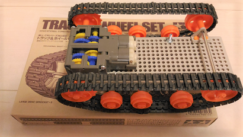

###Chassis

I am very good at paper craft, so I use paper with wood glue and acrylic paint to make a chassis of the toy:

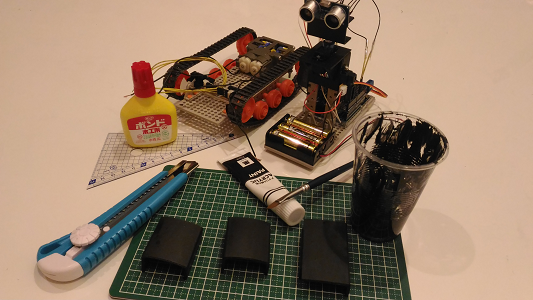

###Protocol between Rapsberry Pi and Arudino Uno

I use Raspberry Pi 3 as a remote controller of the robot. The remote controller sends commands to the robot via WiFi or USB cable. The controller also receives events from the robot.

Commands(Request/Response)
```
   [Arduino Uno R3]<---- command ----[Raspberry Pi 3]
```

Events
```
   [Arduino Uno R3]---- event ---->[Raspberry Pi 3]
```

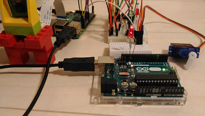

####Commands(Request/Response)

Command format:
```
Format for setter: seven digits decimal number in ASCII code + '\n'
Format for getter: three digits decimal number in ASCII code + '\n'
```

Acknowledgement:
- Setter commands return OK(0) or NG(-1)
- Getter commands return a requested value

#####LED(pin13) control

write(1), led_pin13(0), unit#0(0), plus(0), high(001)
```
1000001\n
```

write(1), led_pin13(0), unit#0(0), plus(0), low(000)
```
1000000\n
```
#####Motor control

(I am replacing AAX3 battery box with AAX4 one right now)

```
TA7291P input/output voltage:
Vs = Vref = 4.5(V)
Vcc = 5(V)
```

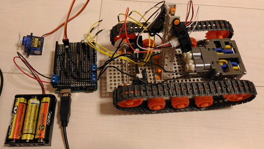

|unit# |direction|level|IN1(PWM)|IN2(PWM)|OUT1(V)| 
|------|---------|-----|---|---|----|
|1(right) or 2(left)|0(forward)        |0 ~ 255  |0 ~ 255|0  |0 ~ +3|
|0(right & left)     |1(reverse)        |0 ~ 255  |0  |0 ~ 255|0 ~ -3|
|1(right) or 2(left)|2(break)        |ANY  |0  |0  |0   |
|1(right) or 2(left)|1(reverse) is not accepted|- |- |- |- |

write(1), motor(1), right(1), forward(0), Vref level(255)
```
1110255\n
```
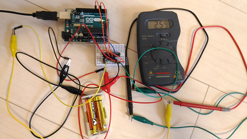

write(1), motor(1), right & left(0), reverse(1), Vref level(255)
```
1101255\n
```
write(1), motor(1), right(1), break(2), Vref level(000)
```
1112000\n
```
#####Servo motor control

write(1), servo motor(2), unit#1(1), plus(0), 90 degrees(090)
```
1210090\n
```

write(1), servo motor(2), unit#1(1), minus(1), 22 degrees(022)
```
1211022\n
```

The following is PWM images captured by Sain Smart DSO Note II(DS202):

- "1211090" -90 degrees

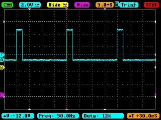

- "1210000" 0 degrees


- "1210090" 90 degrees

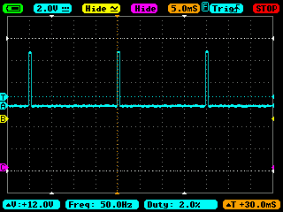

#####Proximity sensor

read(0), proximity sensor(3), unit#0(0)
```
030\n
```
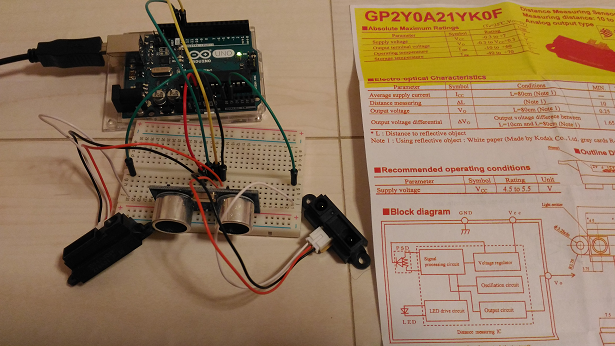

####Events

#####Events detected by proximity sensors

Arduino Uno emits distance info events every 5 seconds.

event(2), proximity sensor(3), unit#0(0), value(073)
```
230073\n
```

event(2), proximity sensor(3), unit#1(1), value(020)
```
231020\n
```

event(2), proximity sensor(3), unit#2(2), value(033)
```
232033\n
```

#####Events detected by photo micro sensors (Omron EE-SX-460-P1)

event(2), photo micro sensor(4), right(1), high(001)
```
241001\n
```

event(2), photo micro sensor(4), left(2), low(000)
```
242000\n
```


My toy has just been equipped with Omron's photo micro sensors:

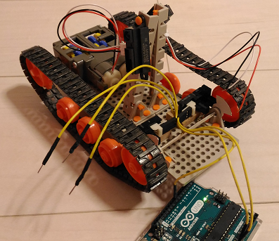

###Electric power for the toy

The power source is AA battery 1.5V * 4 = 6V:
- 6V to the motors via TA7291P motor drivers
- 6V -> 5V to Arduino via TA48M05F
- 6V -> 3.3V to ESP-WROOM-02 via TA48M033F

```
Battery 6V --+-- TA7291P(0 ~ 3V) --> Motor#1
             |
             +-- TA7291P(0 ~ 3V) --> Motor#2
             |
             +-- TA48M05F(6V -> 5V) --> Arduino Uno
             |
             +-- TA48M033F(6V -> 3.3V) --> ESP-WROOM-02
```

###Serial communication between Arduino Uno and ESP-WROOM-02

ESP-WROOM-02 and Arduino Uno use UART (Serial) to communicate with each other.

Since ESP-WROOM-02 uses 3.3V, a logic level converter is inserted between them.

Arduino language provides "Serial" object for hardware serial, so I just use it.

```
 RPi3       ESP-WROOM-02      FXMA108 w/      Arduino Uno
                          bypass condensers
+---+          +----+   3.3V-> +----+ <- 5V    +----+
|   |          |    |          |    |          |    |
|   |          |    +- TxD-----+    +---- RxD -+    |
|   +-- WiFi --+    |  UART    |    |     UART |    |
|   |          |    +- RxD-----+    +---- TxD -+    |
|   |          |    |          |    |          |    |
+---+          +-+--+      GND +----+ OE       +-+--+
                 ^                               ^
                 |                               |
                USB                             USB
                 |                               |
                [PC]                            [PC]
                
 OE is grounded via a 10k ohm pull down register.
 
 Note: USB and PC are used for upgrading/debugging/testing the software.
```

#### Connecting Arduino Uno to ESP-WROOM-02

This is my work:

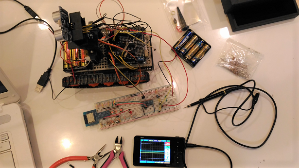

Arduino Uno is connected to ESP-WROOM-02 via bi-directional logic level converter:

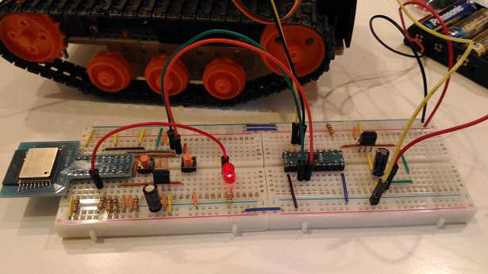

JSON stream from Arduino Uno to MQTT server on Raspberry Pi 3 via ESP-WROOM-02:

Receiving events from the toy with mqtt.js:
```
$ ./mqtt.js sub -t event
{"device_id":"18:FE:34:EF:53:69","event":230025}
{"device_id":"18:FE:34:EF:53:69","event":231035}
{"device_id":"18:FE:34:EF:53:69","event":232033}
{"device_id":"18:FE:34:EF:53:69","event":230036}
{"device_id":"18:FE:34:EF:53:69","event":231037}
{"device_id":"18:FE:34:EF:53:69","event":232034}
{"device_id":"18:FE:34:EF:53:69","event":230036}
{"device_id":"18:FE:34:EF:53:69","event":231045}
{"device_id":"18:FE:34:EF:53:69","event":232035}
{"device_id":"18:FE:34:EF:53:69","event":230036}
{"device_id":"18:FE:34:EF:53:69","event":231037}
{"device_id":"18:FE:34:EF:53:69","event":232035}
{"device_id":"18:FE:34:EF:53:69","event":230038}
{"device_id":"18:FE:34:EF:53:69","event":231046}
{"device_id":"18:FE:34:EF:53:69","event":232035}
{"device_id":"18:FE:34:EF:53:69","event":230034}
                    :
```

Sendind a command "1210090" to the toy with mqtt.js:
```
$ ./mqtt.js pub -t 18:FE:34:EF:53:69 1210090
```

###IoT platform

- Apache ZooKeeper for thing management
- Apache Kafka for data buffering
- Apache Cassandra, MongoDB etc for data collection
- Apache Spark, IPython etc for data analysis


###Networking

- Inter-device: Serial(USB) and WiFi
- Device to IoT platform: WiFi
