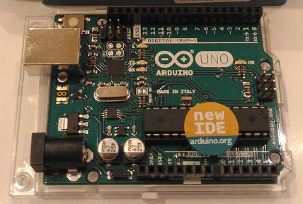

# Internet of Toys (IoT)

##Infrastructure

###Device

####Arduino Uno (AVR ATmega16U2)


####Raspberry Pi (ARM Cortex-A53)


####Parts

###IoT platform

- Apache ZooKeeper
- Apache Kafka
- Apache Cassandra
- Apache Spark


###Networking

- Inter-device: GPIO/SPI/I2C/ZigBee/BLE/USB
- Device to IoT platform: Ethernet and WiFi

##Language

###Device

Golang and JavaScript/Node.js

###IoT platform

Python/Java/Scala

##Device control

###Framework
[Gobot](https://gobot.io/) or [Johnny-Five](http://johnny-five.io/)

```
 [Raspberry Pi]-----(Firmata/USB)-----[Arduino]

```
Unfortunately, Firmata protocol does not support SPI.

###Autonomous

```
 [Raspberry Pi]----GPIO/SPI/I2C---[Arduino]
```

##Tools

I really want 3D printer to make parts!

For the time being, papercraft is OK.
