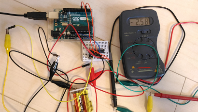

# Internet of Toys (IoT)

##Goal

####Model 001


##Infrastructure

###Device

####Arduino Uno (AVR ATmega16U2)
[pic of my arduino-uno](./doc/arduino-uno.png)

####Raspberry Pi (ARM Cortex-A53)
[pic of my rpi3](./doc/rpi3.png)

####Parts

|part                  |product name                   |maker        |units    |procured|
|----------------------|-------------------------------|-------------|---------|--------|
|Board PC              |Raspberry Pi 3                 |Raspberry Pi |1        |Y       |
|Micro controller      |Arduino Uno R3                 |Arduino      |1        |Y       |
|Servo motor           |Micro serve g9 SG90            |Tower Pro    |1        |Y       |
|Condensor             |100 micro farad                |Rubicon      |1        |Y       |
|Condensor             |10 micro farad                 |Rubicon      |2        |Y       |
|AD converer           |[MCP3008](http://ww1.microchip.com/downloads/en/DeviceDoc/21295C.pdf)                        |Microchip    |1        |Y        |
|Thermister            |[MCP9700](http://ww1.microchip.com/downloads/en/DeviceDoc/21942e.pdf)                        |Microchip    |1        |Y        |
|Proxymity sensor      |[HC-SR04](http://www.micropik.com/PDF/HCSR04.pdf)|SainSmart    |1        |Y       |
|Proxymity sensor      |[GP2Y0A21YK0F](http://www.sharpsma.com/webfm_send/1489)|Sharp   |2       |Y       |
|Photo micro sensor    |[EE-SX460-P1](https://www.omron.com/ecb/products/pdf/en-ee_sx460_p1.pdf)|Omron |2   |Y   |
|Camera module         |Raspberry Pi Camera Board v1.3 |Element      |1        |Y       |
|LED(red)              |                               |             |1        |Y       |
|LED(blue)             |                               |             |1        |Y       |
|CdS                   |MI5                            |Macron       |1        |Y       |
|Piezonelectric sounder|PKM13EPYH4000-A0               |muRata       |1        |Y       |
|Motor driver          |[TA7291P](http://www.promelec.ru/pdf/ta7291p.pdf)|Toshiba      |2        |Y        |
|Double gearbox        |[Double gearbox 70168](http://www.tamiya.com/japan/products/70168double_gearbox/)|Tamiya       |1        |Y       |
|Track and wheel       |[Track and wheel set 70100](http://www.tamiya.com/japan/kousaku/k_products/70100_t&w.htm)|Tamiya       |1        |Y       |
|Universal plate       |[Universal plate set 70157](http://www.tamiya.com/japan/products/70157plate/index.htm)|Tamiya       |1        |Y       |
|USB cable             |                               |             |1        |Y       |
|Universal board       |                               |             |2        |Y       |
|Terminal block        |2pin                           |             |4        |Y       |
|Registers             |                               |             |many     |Y       |
|Cables                |                               |             |many     |Y       |
|Battery box           |AA X 2 (4.5V)                  |             |1        |N       |


###Protocol between Rapsberry Pi and Arudino Uno

Commands(Request/Response)
```
   [Arduino Uno R3]<---- command ----[Raspberry Pi 3]
```

Events
```
   [Arduino Uno R3]---- event ---->[Raspberry Pi 3]
```


####Commands(Request/Response)

Command format:
```
Format for setter: seven digits decimal number in ASCII code + '\n'
Format for getter: three digits decimal number in ASCII code + '\n'
```

Acknowledgement:
- Setter commands return OK(0) or NG(-1)
- Getter commands return a requested value

#####LED(pin13) control

write(1), led_pin13(0), unit#0(0), plus(0), high(001)
```
1000001\n
```

write(1), led_pin13(0), unit#0(0), plus(0), low(000)
```
1000000\n
```
#####Motor control

```
TA7291P input/output voltage:
Vs = Vref = 3(V)
Vcc = 5(V)
```

|unit# |direction|level|IN1(PWM)|IN2(PWM)|OUT1(V)| 
|------|---------|-----|---|---|----|
|1(right) or 2(left)|0(forward)        |0 ~ 255  |0 ~ 255|0  |0 ~ +1.1|
|0(right & left)     |1(reverse)        |0 ~ 255  |0  |0 ~ 255|0 ~ -1.1|
|1(right) or 2(left)|2(break)        |ANY  |0  |0  |0   |
|1(right) or 2(left)|1(reverse) is not accepted|- |- |- |- |

Note: The pictures below shows max +/-2.6(V) w/o a motor(i.e., 0(A)). The Vs voltage 3(V) is not large enough: 4.5(V) seems to be the best.

write(1), motor(1), right(1), forward(0), Vref level(255)
```
1110255\n
```


write(1), motor(1), right & left(0), reverse(1), Vref level(255)
```
1101255\n
```


write(1), motor(1), right(1), break(2), Vref level(000)
```
1112000\n
```


#####Servo motor control

write(1), servo motor(2), unit#0(0), plus(0), 90 degrees(090)
```
1200090\n
```

write(1), servo motor(2), unit#1(1), minus(1), 22 degrees(022)
```
1211022\n
```

#####Proximity sensor

read(0), proximity sensor(3), unit#0(0)
```
030\n
```


####Events

#####Events detected by photo micro sensors (Omron EE-SX-460-P1)

event(2), photo micro sensor(4), right(1), high(001)
```
2110001\n
```

event(2), photo micro sensor(4), left(2), low(000)
```
2121001\n
```


###IoT platform

- Apache ZooKeeper for thing management
- Apache Kafka for data buffering
- Apache Cassandra, MongoDB etc for data collection
- Apache Spark, IPython etc for data analysis


###Networking

- Inter-device: GPIO/SPI/I2C/ZigBee/BLE/USB
- Device to IoT platform: Ethernet and WiFi

