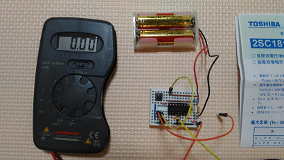
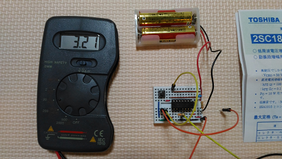
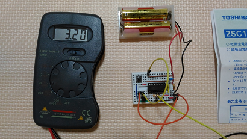
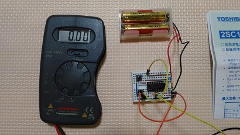

# Flip-flop circuit

### Initial state

### Either Push the tactile switch (flip)

### Or put 3V to the base of 2SC1815 (flip)

### Put the base to GND

### Push the tactile switch again (flop)

