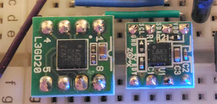

# HMC5883L and L3GD20



## HMC5883L (geomagnetic sensor)

### Sensor calibration

Reference: http://www.jameco.com/Jameco/Products/ProdDS/2150248.pdf

#### X-axis/Y-axis measurement

Measurement rotating the sensor 360 degrees clockwise
```
X,Y     
-44,40
-171,14
-261,55
-312,-147
-326,-292
-278,-427
-238,-469
-147,-537
4,-561
138,-506
228,-415
263,-325
262,-222
221,-101
127,-14
-57,8
```

#### Result

```
Xmax = 263
Xmin = -326 
Ymax = 55
Ymin = -537
```

### Direction in radian

```
              y ^   North
                |  /
                | / theta
      ----------+---------->
                |        x
                |

theta = atan2(y, x)
```

|Direction|Theta in Radian|
|---------|---------------|
|N  |0*pi/8|
|NNE|1*pi/8|
|NE |2*pi/8|
|ENE|3*pi/8|
|E  |4*pi/8|
|ESE|5*pi/8|
|SE |6*pi/8|
|SSE|7*pi/8|
|S  |pi or -pi|
|SSW|-7*pi/8|
|SW |-6*pi/8|
|WSW|-5*pi/8|
|W  |-4*pi/8|
|WNW|-3*pi/8|
|NW |-2*pi/8|
|NNW|-1*pi/8|

## L3GD20 (Gyroscope and temperature sensor)

...
