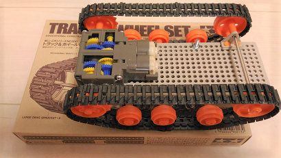

# Parts list

|part                  |product name                   |maker        |quantities|procured|
|----------------------|-------------------------------|-------------|---------|--------|
|Single board computer |Raspberry Pi 3                 |Raspberry Pi |1        |Y       |
|Micro controller      |Arduino Uno R3                 |Arduino      |1        |Y       |
|WiFi module           |[ESP-WROOM-02](http://espressif.com/en/products/hardware/esp-wroom-02/overview)|Espressif|1|Y|
|Logic level converter |[8bit bidrectional logic level converter (FXMA408)](http://akizukidenshi.com/catalog/g/gM-04522/)|Akizuki Denshi|1        |Y       |
|Regulator             |TA48M033F                      |Toshiba      |1        |Y       |
|Servo motor           |Micro servo g9 SG90            |Tower Pro    |1        |Y       |
|Capacitor             |100 micro farad (for servo motor)               |Rubycon      |1        |Y       |
|Capacitor             |10 micro farad (for photo micro sensors)                |Rubycon      |1        |Y       |
|Capacitor             |47 micro farad (for TA48M033F)                |Rubycon      |1        |Y       |
|Capacitor             |0.1 micro farad (for TA48M033F)               |             |1        |Y       |
|Proxymity sensor      |[HC-SR04](http://www.micropik.com/PDF/HCSR04.pdf)|SainSmart    |1        |Y       |
|Proxymity sensor      |[GP2Y0A21YK0F](http://www.sharpsma.com/webfm_send/1489)|Sharp   |2       |Y       |
|Photo micro sensor    |[EE-SX460-P1](https://www.omron.com/ecb/products/pdf/en-ee_sx460_p1.pdf)|Omron |2   |Y   |
|Geomagnetic           |[AE-HMC5883L](http://akizukidenshi.com/catalog/g/gK-09705/)|Akizuki/Honywell|1|Y|
|Gyro/temperature sensor|[AE-L3GD20](http://akizukidenshi.com/catalog/g/gK-06779/)|Akizuki / ST micro|1        |Y        |
|LED(red)              |                               |             |1        |Y       |
|LED(blue)             |                               |             |1        |Y       |
|Transistor            |[2SC1815](http://akizukidenshi.com/download/2sc1815-gr.pdf) |Tosihba      |1        |Y       |
|MOSFET                |[2SK2232](http://akizukidenshi.com/download/2sk2232.pdf)    |Toshiba      |1        |Y       |
|Schmitt-triger inverter IC|[SN74HC14N](http://www.ti.com/lit/ds/symlink/sn54hc14.pdf)|Texas Instruments|1    |Y       |
|Motor driver          |[TA7291P](http://www.promelec.ru/pdf/ta7291p.pdf)|Toshiba      |2        |Y        |
|Double gearbox        |[Double gearbox 70168](http://www.tamiya.com/japan/products/70168double_gearbox/)|Tamiya       |1        |Y       |
|Track and wheel       |[Track and wheel set 70100](http://www.tamiya.com/japan/kousaku/k_products/70100_t&w.htm)|Tamiya       |1        |Y       |
|Universal plate       |[Universal plate set 70157](http://www.tamiya.com/japan/products/70157plate/index.htm)|Tamiya       |1        |Y       |
|USB cable             |                               |             |1        |Y       |
|Universal board       |                               |             |2        |Y       |
|Terminal block        |2pin                           |             |4        |Y       |
|Registers             |                               |             |many     |Y       |
|Cables                |                               |             |many     |Y       |
|Battery box           |[AA X 6 (9V)](http://akizukidenshi.com/catalog/g/gP-10611/) |             |1        |Y       |
|Battery snap          |[BS-IC](http://akizukidenshi.com/catalog/g/gP-00452/)|  | 1 |Y  |
|Toggle switch         |                             |             |1        |Y       |
|Tactile switch        |                             |Alps         |2        |Y       |
|Vanila shield and pin headers #1|                         |             |1        |Y       |
|Vanila shield and pin headers #2|                         |             |1        |Y       |

