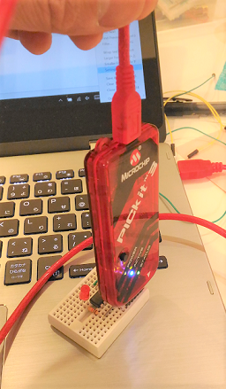
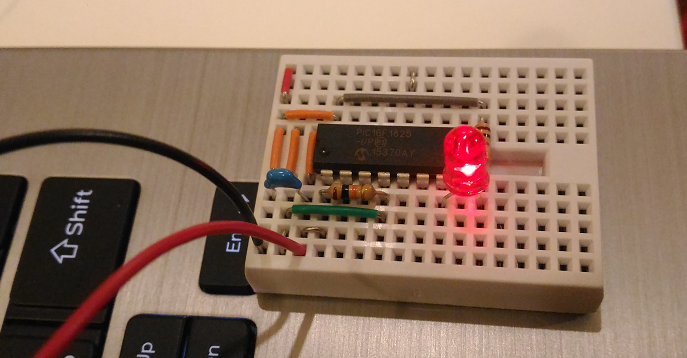
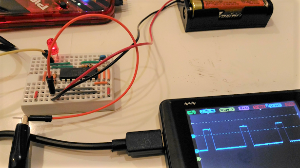
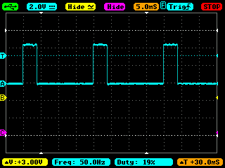
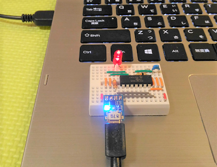
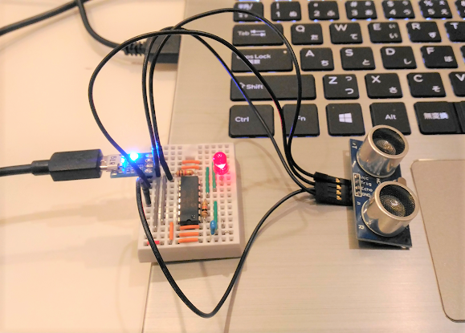

# PIC16F1825 LED blinking

2016/12/27

I have just tested LED blinking with PIC16F1825-I/P.

I use PICkit3 to upload code to PIC:



## LED blinking

I have tried out LED blinking powered by AA x 3:



The test code is as follows:

```
#define _XTAL_FREQ 500000  // 500kHz

#include <xc.h>

// CONFIG1
#pragma config FOSC = INTOSC    // Oscillator Selection (INTOSC oscillator: I/O function on CLKIN pin)
#pragma config WDTE = OFF       // Watchdog Timer Enable (WDT disabled)
#pragma config PWRTE = OFF      // Power-up Timer Enable (PWRT disabled)
#pragma config MCLRE = ON       // MCLR Pin Function Select (MCLR/VPP pin function is MCLR)
#pragma config CP = OFF         // Flash Program Memory Code Protection (Program memory code protection is disabled)
#pragma config CPD = OFF        // Data Memory Code Protection (Data memory code protection is disabled)
#pragma config BOREN = OFF      // Brown-out Reset Enable (Brown-out Reset disabled)
#pragma config CLKOUTEN = OFF   // Clock Out Enable (CLKOUT function is disabled. I/O or oscillator function on the CLKOUT pin)
#pragma config IESO = ON        // Internal/External Switchover (Internal/External Switchover mode is enabled)
#pragma config FCMEN = ON       // Fail-Safe Clock Monitor Enable (Fail-Safe Clock Monitor is enabled)

// CONFIG2
#pragma config WRT = OFF        // Flash Memory Self-Write Protection (Write protection off)
#pragma config PLLEN = ON       // PLL Enable (4x PLL enabled)
#pragma config STVREN = ON      // Stack Overflow/Underflow Reset Enable (Stack Overflow or Underflow will cause a Reset)
#pragma config BORV = LO        // Brown-out Reset Voltage Selection (Brown-out Reset Voltage (Vbor), low trip point selected.)
#pragma config LVP = ON         // Low-Voltage Programming Enable (Low-voltage programming enabled)

int main()
{
  OSCCONbits.IRCF = 0b0111;  // 500kHz
  TRISCbits.TRISC3 = 0;  // RC3 as output GPIO
  LATCbits.LATC3 = 1;
  while(1) {
    __delay_ms(1000);
    LATCbits.LATC3 ^= 1;
  }
  return 0;
}
```

## Testing PWM

I test PWM at 50Hz. 50Hz PWM is to be used for controlling motors such as a servo motor (sg90) or DC motors (Mabuchi motors).

```
-------------------PR2---------->
--CCPR1-->                        
+--------+                      +---
|        |                      |
|        |                      |
+        +----------------------+
            PWM (50Hz)
```

### Parameters for generating 50Hz PWM

|Parameter                       |Value  |
|--------------------------------|-------|
|Frequency of internal oscillator|500kHz |
|Prescaler                       |16     |
|PWM frequency                   |50Hz   |
|PR2                             |155    |
|CCPR1                           |0 - 155|
|WatchDog Timer (WDT)            |enabled|

### Source code



Note that anode of LED (red) is connected to RC5 rather than RC3 in this case, since RC5 supports CCP1 to generate PWM.

[Source code](./pwm_test.c)

### Confirmation by using SainSmart DS202

The following is PWM at 50Hz with 20% duty:



### Testing Watchdog Timer (WDT)

It's easy. Just comment out CLRWDT(); in the code above.

I have confirmed that the LED blinks, since WDT resets PIC16F1825 every two seconds that is a default WDT timeout value.

### PWM resolution problem

Servo motor "Tower Pro sg90" requires 1 - 2 msec HIGH within 20msec (50Hz). 1 msec range covers -90 degrees to 90 degrees.

155/20 = 7.75 that is too coarse. I know how to resolve this issue, and I will try to increase the resolution later on.

The resolution is OK for controlling TA7291P or LED blightness.

## Testing USART

I use  [this module (FT234X)](http://akizukidenshi.com/catalog/g/gM-08461/) to get access to PIC16F1825 from my PC via USB.

Set up:
```
                               +---------------------------------+
                               |                PIC16F1825       |
                               |                 +-----+         |
                               |  +-------- VDD 1|     |14 VSS --+
                               |  |             2|     |
                               |  |             3|     |
                             +------+           4|     |
[TeraTerm on Win10]---USB ---|FTDI  |--- RX/RC5 5|     |
                             |FT234X|--- TX/RC4 6|     |
                             +------+           7|     |
                                                 +-----+
```



### TeraTerm set up

```
Setup -> Serial port -> Baud rate: 9600
Setup -> Terminal -> New Line -> Receive: LF, Transmit: LF
```
### Source code

[source code](./usart_test.c)

## Testing digital input with HC-SR04

This is something I wanted for my other project as well as for this project.

The PIC-based tiny system provides the following capabilities:
- USB-UART bridge
- Distance measurement with HC-SR04 ultra sonic sensor
- Status indicator (LED red)



It is nice to use this tiny 5V system as a 5V peripheral controller with another 3.3V system (e.g., ESP-WROOM-02 or Raspberry Pi), like this:

```
       Events (Serial at 9600 baud)
      ============================>
[PIC16F1825]--- USB ---[ESP8266 or Raspberry Pi 3]
      |
  GPIO/AnalogIn
      |
[5V sensors]
```

### Source code

[source code](./hc_sr04_test.c)
