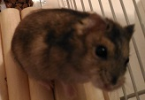

#TensorFlow

I have installed TensorFlow on my Raspberry Pi 3 Model B.

##TensorFlow for Raspberry Pi

###Installation and test

https://github.com/samjabrahams/tensorflow-on-raspberry-pi

```
pi@raspberrypi:/usr/local/lib/python2.7/dist-packages/tensorflow/models/image/imagenet $ python classify_image.py
giant panda, panda, panda bear, coon bear, Ailuropoda melanoleuca (score = 0.89233)
indri, indris, Indri indri, Indri brevicaudatus (score = 0.00859)
lesser panda, red panda, panda, bear cat, cat bear, Ailurus fulgens (score = 0.00264)
custard apple (score = 0.00141)
earthstar (score = 0.00107)
```

###My hamster

She is my hamster "Ruby" (her name is NOT Python).



````
hamster (score = 0.45782)
panpipe, pandean pipe, syrinx (score = 0.32480)
fox squirrel, eastern fox squirrel, Sciurus niger (score = 0.01677)
mousetrap (score = 0.01429)
radiator (score = 0.00905)
```


```
hamster (score = 0.72409)
wombat (score = 0.05403)
black-footed ferret, ferret, Mustela nigripes (score = 0.04547)
polecat, fitch, foulmart, foumart, Mustela putorius (score = 0.04081)
weasel (score = 0.01739)
```


```
hamster (score = 0.53216)
wombat (score = 0.10011)
Norwegian elkhound, elkhound (score = 0.07616)
black-footed ferret, ferret, Mustela nigripes (score = 0.01688)
Crock Pot (score = 0.01552)
```


```
mousetrap (score = 0.60099)
fox squirrel, eastern fox squirrel, Sciurus niger (score = 0.11269)
wood rabbit, cottontail, cottontail rabbit (score = 0.08913)
beaver (score = 0.03204)
hare (score = 0.01051)
```

###Cars

Lexus IS 250: https://media.ed.edmunds-media.com/lexus/is-250/2014/oem/2014_lexus_is-250_sedan_base_fq_oem_3_423.jpg
```
sports car, sport car (score = 0.35326)
car wheel (score = 0.29320)
grille, radiator grille (score = 0.15563)
beach wagon, station wagon, wagon, estate car, beach waggon, station waggon, waggon (score = 0.07977)
racer, race car, racing car (score = 0.01234)
```

Nissan Note: https://car.kurumagt.com/wp-content/uploads/2015/08/ivo20150017-300x205.jpg
```
minivan (score = 0.90877)
minibus (score = 0.02228)
car wheel (score = 0.00255)
beach wagon, station wagon, wagon, estate car, beach waggon, station waggon, waggon (score = 0.00153)
vacuum, vacuum cleaner (score = 0.00121)
```

Nissan Note is not a mini van, but the shape is certainly like a mini van...

##Jupyter

###Installation

```
$ sudo pip install jupyter
```

###Running Juypter

```
$ jupyter-notebook --ip="*"
```

###Libraries

```
$ sudo pip --no-cache-dir matplotlib
$ sudo apt-get install libblas-dev liblapack-dev libatlas-base-dev gfortran
$ sudo pip install scikit-image
```

##OpenCV

###Installation

Install libv4l-dev before building OpenCV:
```
$ sudo apt-get install libv4l-dev
```

Follow the instructions here to build OpenCV: http://docs.opencv.org/3.0-last-rst/doc/tutorials/introduction/linux_install/linux_install.html

Add the following options to cmake:
```
-D WITH_LIBV4L=ON
-D OPENCV_EXTRA_MODULES_PATH = <path to opencv_contrib/modules/>
```

It took one hour to complete the build processes.

###Working with Pi Camera

http://www.pyimagesearch.com/2015/03/30/accessing-the-raspberry-pi-camera-with-opencv-and-python/
